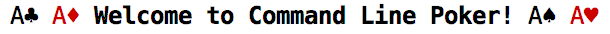
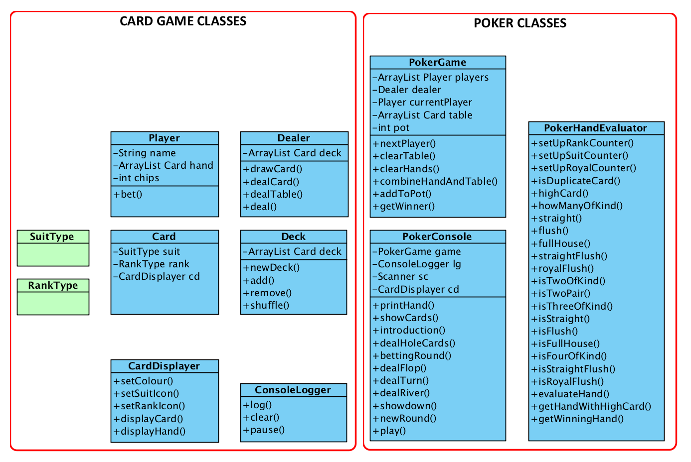
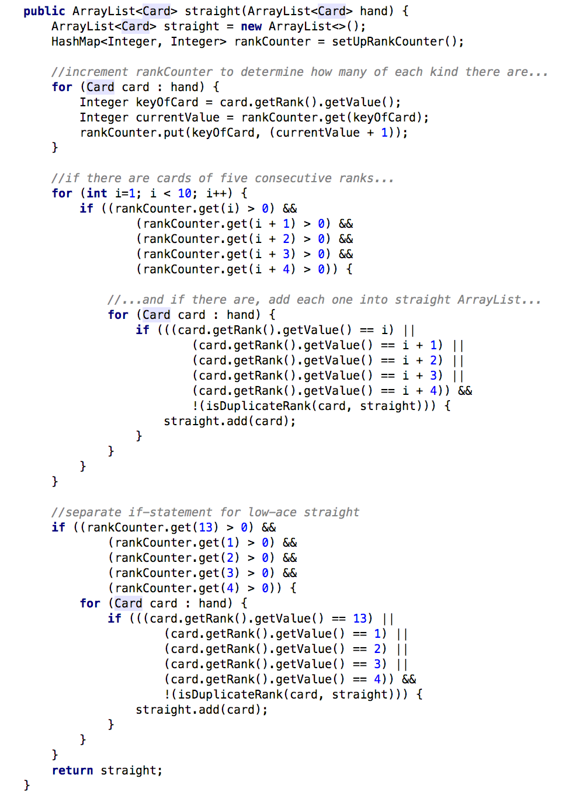
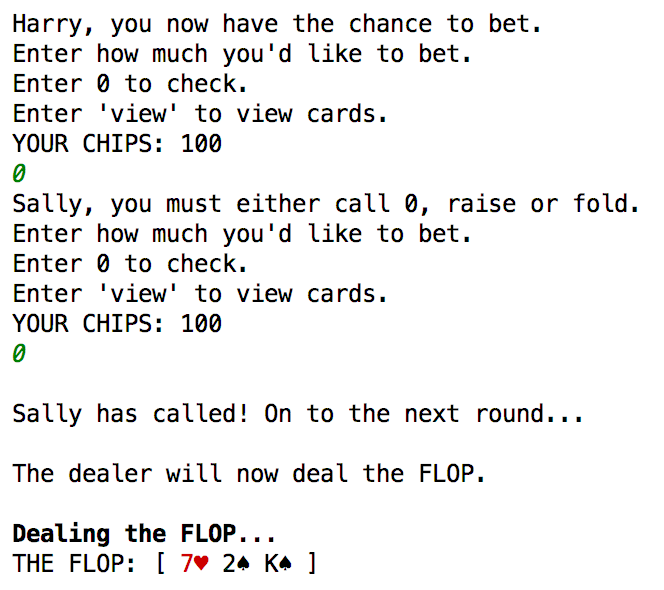
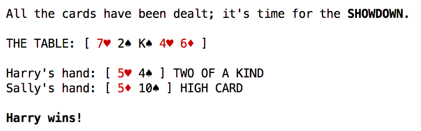

# JavaPoker
A model of the card game poker in Java, with a focus on strong OO design and the SOLID principles.

# Outline
I developed this program as an individual assignment for CodeClan's 16-week intro to software development course. I decided to try my hand at writing a poker engine because I was interested in the logic involved in evaluating poker hands, and because I wanted to focus on refining my OO design skills. 

# Features

- A poker hand evaluator engine, which determines what poker hand a player has, and compares hands to determine the winner. 
- Strong OO design. All but 3 of the classes form a card-game program that could work with any card game using the standard, 52-card deck;
  the only classes that are poker specific are the hand-evaluator, the game class, and the console runner class. 
- A command-line interface, where two players can take part in rounds of betting and dealing. 

Class diagram:

# Poker Hand Evaluator
(image below)

The PokerHandEvaluator class is designed to take in an ArrayList of Cards (the Player's hand), and determine its poker score. The methods for checking a particular poker hand (straight, flush, and so on) work in a similar way. First, it creates a HashMap with either the Rank or Suit Enums as keys, and Integers as values, set at 0. Then it iterates through the Cards in the Hand, and increments the relevant value in the HashMap. This results in a HashMap documenting how many of each rank or suit there are. 

The next step loops through this HashMap, and checks for the relevant hand. In the example below we are looking for a straight; so, we check whether there are Cards in the Hand of five consecutive ranks. This includes a separate if-statement for a low-ace straight. 

# Console

The program allows players to place bets in the console as the table cards are dealt...

...and then declares a winner, implementing the PokerHandEvaluator logic.

